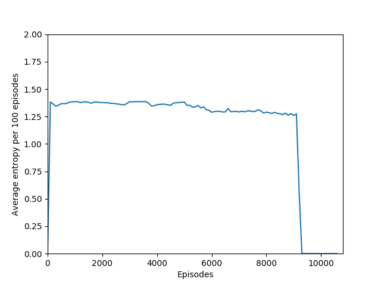
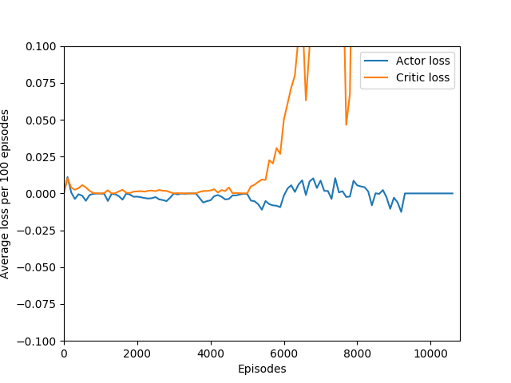
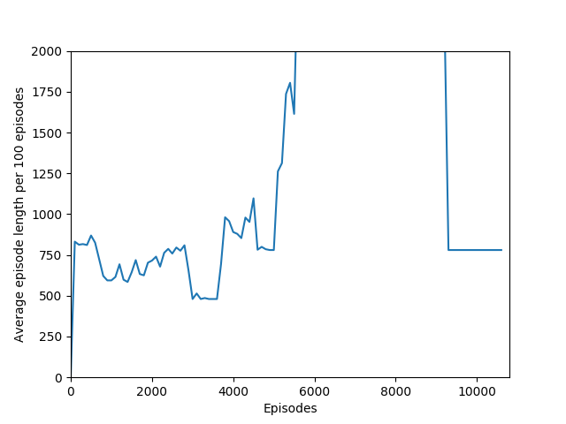
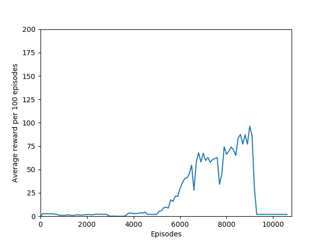

# breakout-demo

Super simple, no-frills A2C agent that achieves over 200 reward on Atari Breakout, with [MG2033/A2C](https://github.com/MG2033/A2C) and [openai/baselines](https://github.com/openai/baselines) as reference.

Here's the corresponding [blog post](http://blog.jzhanson.com/blog/rl/project/2018/05/28/breakout.html).

To train a model from scratch, run

`python a2c.py`

I recommend a value of N = 50 or 100 for best results, though training does take some time with those values.

`python a2c.py --n 100`

Better graphs, Tensorboard visualizations, testing, and saved model files on the way.

### Results

| N     | Max Reward | Iterations before overfit |
|-------|------------|------------|
|1      |            |            |
|5      |            |            |
|20     | 376        |            |
|50     | 397        | 1020626    |
|100    | 426 (so far)|           |
|Inf    |             |           |

It is interesting to note that after about 9000 training episodes (4M iterations) on one environment the softmax output converges to zeroes and ones and the agent performance plummets — a case of "overfitting" in reinforcement learning! Despite the learning rate decay, training is still not stable enough to continue slow improvement or even plateau. I believe there is something to be discovered in exactly why this happens and how to remedy it.

The graphs are from N = 20. I have also encountered a similar issue with N = 50, but none yet with N = 100.

